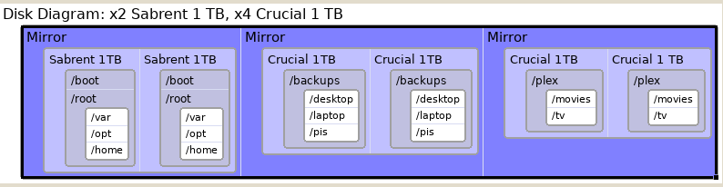

This is an overview of the start/finish design choices and configurations for desktop PC build.

| Hardware |
| :--- |
| AMD Ryzen 7 3800X |
| Scythe FUMA 2 |
| Asrock x570m Pro 4 |
| Thermaltake V21 Case |
| Crucial Ballistix 64GB (16GB x 4) |
| Sabrent 4.0 Rocket 1TB (x2) |
| Crucial MX500 1TB SSD (x4) |
| Supernova P2 650 PSU |
| AMD 5700 xt GPU |
| BeQuiet SilentWings 140mm (x2) |
| BeQuiet SilentWings 120mm (x3) |

### Disk Layout

*Overview of disk layout, ZFS mirrors*
